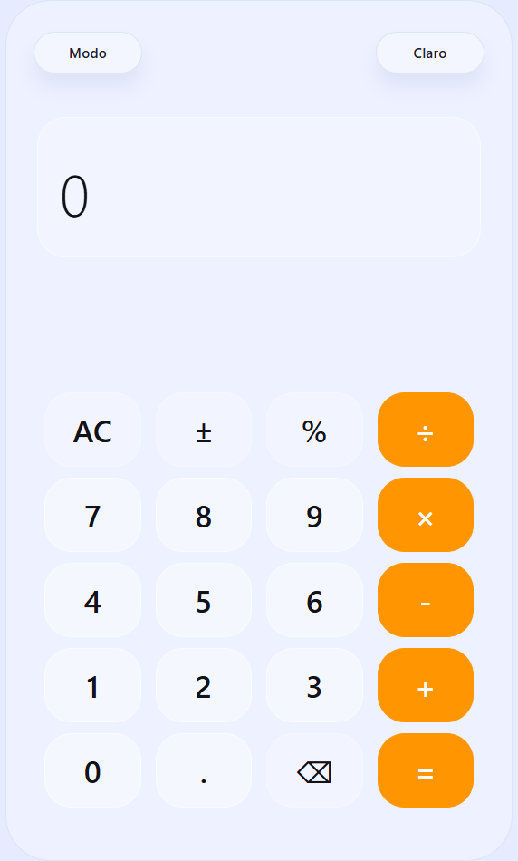
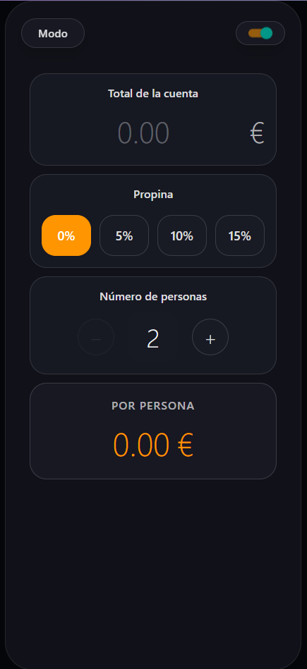

# Calculadora React Native (Expo)

Aplicación de calculadora con dos modos de uso: calculadora normal y calculadora para dividir gastos entre varias personas. Construida con React Native y Expo, con soporte para tema claro/oscuro y una interfaz moderna y accesible.

## Características
- Modo calculadora estándar con teclado personalizado.
- Modo “Dividir gastos” para repartir importes, propinas, y ajustes por persona.
- Tema claro/oscuro conmutables desde la interfaz.
- Animaciones sutiles y uso de `expo-blur` para menús flotantes.
- Código en TypeScript y estructura de componentes reutilizables.

## Estructura principal
- `App.tsx`: orquesta el estado global (tema, modo) y muestra el contenido según el modo activo.
- `src/components/MyKeyboard.tsx`: teclado e interfaz de la calculadora normal.
- `src/components/SplitExpensesCalculator.tsx`: lógica e interfaz para dividir gastos.
- `src/styles/GlobalStyles.tsx`: estilos base y variables de tema.
- `index.js`: punto de entrada de la app con `registerRootComponent`.

## Requisitos
- Node.js 18+
- Expo CLI (opcional, se puede usar con `npx expo`)

## Instalación y ejecución
En el directorio raíz del proyecto:

```
npm install
npm run start
```

Atajos útiles:
- `npm run android` — abre Expo en Android
- `npm run ios` — abre Expo en iOS (macOS)
- `npm run web` — abre la versión web

## Modo “Dividir gastos”
El modo “Dividir gastos” permite:
- Introducir el total del gasto.
- Definir número de participantes.
- Ajustar propina/impuestos si aplica.
- Obtener el coste por persona con redondeo configurable.

Para acceder a este modo, abre el menú “Modo” en la parte superior y selecciona “Dividir Gastos”.

## Capturas de pantalla

Vista principal:

<p align="center">
  
</p>

Calculadora “Dividir gastos”:

<p align="center">
  
</p>

Si prefieres un enlace remoto, sube la imagen a tu repositorio (por ejemplo, en `assets/`) y usa la URL cruda del archivo en GitHub.

## Cómo añadir/actualizar capturas
1. Toma la captura en el dispositivo/emulador donde estés probando la app.
2. Guarda la imagen en la carpeta `assets/` del proyecto (por ejemplo: `assets/split-expenses.png`).
3. Confirma que el nombre coincide con el del README o actualiza la ruta en esta sección.

## Tecnologías
- React Native (`react-native`)
- Expo (`expo`, `expo-blur`, `expo-linear-gradient`, `expo-status-bar`)
- React 19 + React Native Web (para vista web)
- TypeScript

## Contribuir
Las contribuciones son bienvenidas. Antes de abrir un PR:
- Alinea el estilo con los componentes existentes.
- Evita introducir dependencias innecesarias.
- Prueba ambos modos (normal y dividir gastos) en modo claro/oscuro.

## Licencia
Uso educativo y personal. Ajusta la licencia según tus necesidades si planeas distribuir la app.


