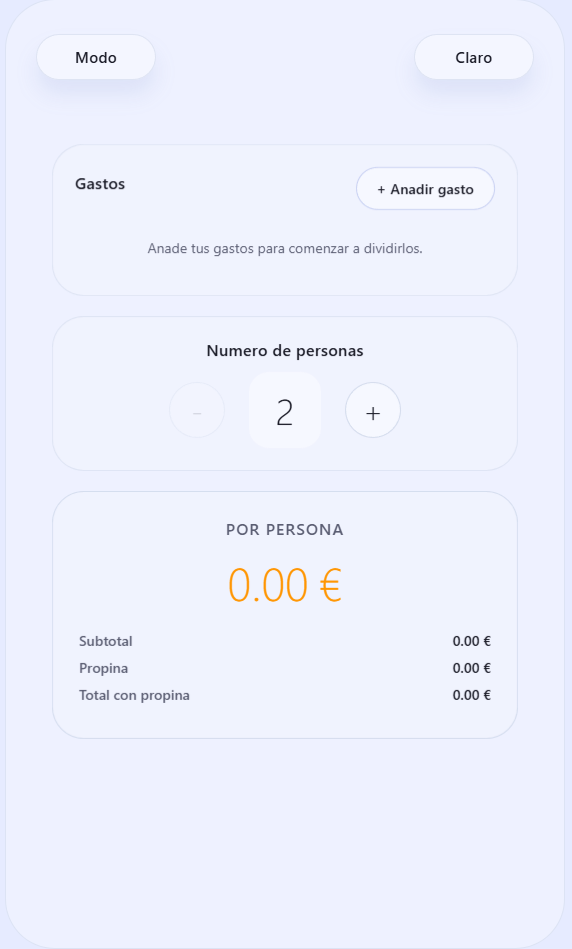

# 🧮 Calculadora React Native (Expo)

Aplicación de calculadora profesional con **diseño Liquid Glass** inspirado en Apple, que incluye dos modos de uso: calculadora estándar y un gestor completo para dividir gastos entre varias personas. Construida con React Native y Expo, con animaciones fluidas, efectos de blur modernos y soporte completo para tema claro/oscuro.

## ✨ Características Principales

### 🎨 Diseño y Estética
- **Liquid Glass Effect**: Interfaz con efecto de cristal líquido usando transparencias y blur
- **Tema claro/oscuro**: Cambio instantáneo entre modos con animaciones suaves
- **Animaciones fluidas**: Efectos spring en botones, transiciones suaves y feedback táctil
- **Responsive**: Adaptado para móvil, tablet y web con diseño responsivo completo
- **Efectos de profundidad**: Sombras dinámicas y glows de colores para crear profundidad

### 🧮 Calculadora Estándar
- Operaciones básicas: suma, resta, multiplicación, división
- Operador de porcentaje contextual inteligente
- Cambio de signo y función AC (All Clear)
- Display con scroll horizontal para números largos
- Historial de operaciones visible
- Teclado personalizado con animaciones

### 💰 Dividir Gastos Avanzado
- **Gestión múltiple de gastos**: Añade varios gastos diferentes con sus propios montos
- **Propina individual por gasto**: Cada gasto puede tener su propia propina (0%, 5%, 10%, 15% o personalizada)
- **Cálculo automático**: Suma total de gastos + propinas dividido entre las personas
- **Control de personas**: Botones +/- para ajustar número de participantes (mínimo 2)
- **Desglose detallado**: Muestra subtotal, propina total y total con propina
- **Persistencia de datos**: Los gastos se guardan automáticamente con AsyncStorage
- **Lista de gastos**: Visualiza todos los gastos añadidos con sus montos y propinas
- **Limpiar todo**: Botón para eliminar todos los gastos de una vez
- **Modal para añadir gastos**: Interfaz intuitiva con blur para añadir nuevos gastos

## 📁 Estructura del Proyecto

```
calculadora/
├── App.tsx                           # Componente principal, gestión de tema y navegación
├── index.js                          # Punto de entrada (React Native Web)
├── src/
│   ├── components/
│   │   ├── Button.tsx               # Botón animado con efecto liquid glass
│   │   ├── MyKeyboard.tsx           # Calculadora estándar con lógica completa
│   │   └── SplitExpensesCalculator.tsx  # Gestor completo de gastos compartidos
│   ├── context/
│   │   └── ThemeContext.tsx         # Contexto para tema claro/oscuro
│   └── styles/
│       ├── Colors.ts                # Paleta de colores con transparencias
│       └── GlobalStyles.tsx         # Estilos globales y liquid glass
├── assets/                           # Imágenes y recursos
└── package.json
```

### Componentes Clave

#### `App.tsx`
- Gestiona el estado global (tema, modo de calculadora)
- Menú desplegable animado con BlurView para cambiar de modo
- Botones de header simétricos con animaciones spring
- Shell de calculadora con efecto liquid glass
- Glows de fondo con gradientes animados

#### `MyKeyboard.tsx`
- Lógica completa de calculadora con evaluación de expresiones
- Manejo inteligente del operador de porcentaje
- Display con scroll y gradientes de fade
- Detección automática de tamaño de fuente según longitud
- Animaciones de presión en cada botón

#### `SplitExpensesCalculator.tsx`
- Sistema completo de gestión de gastos múltiples
- Modal animado con BlurView para añadir gastos
- Inputs con propina individual por gasto (presets + personalizada)
- Persistencia con AsyncStorage
- Cálculos automáticos en tiempo real
- Animaciones de layout con LayoutAnimation

#### `Button.tsx`
- Botón reutilizable con animación spring
- Efecto shimmer sutil para glass effect
- Tres variantes: primary, utility, accent
- Responsive según tamaño de pantalla

## Requisitos
- Node.js 18+
- Expo CLI (opcional, se puede usar con `npx expo`)

## Instalación y ejecución
En el directorio raíz del proyecto:

```
npm install
npm run start
```

Atajos útiles:
- `npm run android` — abre Expo en Android
- `npm run ios` — abre Expo en iOS (macOS)
- `npm run web` — abre la versión web

## 💡 Cómo Usar el Modo "Dividir Gastos"

### Añadir Gastos
1. Presiona el botón **"+ Añadir gasto"** en la sección "Gastos"
2. Se abrirá un modal con efecto blur donde puedes:
   - **Título del gasto**: Nombre descriptivo (ej: "Cena", "Taxi", "Entradas")
   - **Cantidad**: Monto del gasto sin propina
   - **Propina** (opcional): Monto exacto de propina o usa los presets

### Configurar Propina
Para cada gasto individual puedes elegir:
- **0%**: Sin propina
- **5%**: Propina del 5%
- **10%**: Propina estándar del 10%
- **15%**: Propina generosa del 15%
- **Personalizado**: Introduce tu propio porcentaje

La propina se calcula automáticamente y se suma al total del gasto.

### Ajustar Participantes
- Usa los botones **-** y **+** en la sección "Número de personas"
- Mínimo: 2 personas
- Máximo: 99 personas
- El cálculo se actualiza automáticamente

### Ver Resultados
La sección "POR PERSONA" muestra:
- **Monto principal**: Cantidad que debe pagar cada persona (grande, en naranja)
- **Subtotal**: Total de gastos sin propinas
- **Propina**: Total de propinas de todos los gastos
- **Total con propina**: Suma completa dividida entre las personas

### Gestionar Gastos
- **Ver lista**: Todos los gastos aparecen debajo del botón "Añadir gasto"
- **Eliminar gasto**: Presiona la **X** en cada gasto individual
- **Limpiar todo**: Botón "Limpiar todo" para empezar de cero
- **Persistencia**: Los datos se guardan automáticamente y persisten entre sesiones

### Cambiar de Modo
Para volver a la calculadora normal:
1. Presiona el botón **"Modo"** en la esquina superior izquierda
2. Selecciona **"Calculadora Normal"** del menú desplegable

## Capturas de pantalla

Vista principal:

<p align="center">
  
</p>

Calculadora “Dividir gastos”:

<p align="center">
  
</p>

Si prefieres un enlace remoto, sube la imagen a tu repositorio (por ejemplo, en `assets/`) y usa la URL cruda del archivo en GitHub.

## Cómo añadir/actualizar capturas
1. Toma la captura en el dispositivo/emulador donde estés probando la app.
2. Guarda la imagen en la carpeta `assets/` del proyecto (por ejemplo: `assets/split-expenses.png`).
3. Confirma que el nombre coincide con el del README o actualiza la ruta en esta sección.

## 🛠️ Tecnologías y Dependencias

### Core
- **React Native** 0.76.5 - Framework principal
- **React** 19 - Biblioteca de UI
- **Expo** ~54.0.13 - Plataforma de desarrollo
- **TypeScript** - Tipado estático

### UI y Efectos
- **expo-blur** ~15.0.7 - Efectos de blur para liquid glass
- **expo-linear-gradient** ~14.0.1 - Gradientes lineales
- **expo-status-bar** ~2.0.0 - Control de la barra de estado

### Persistencia
- **@react-native-async-storage/async-storage** - Almacenamiento local de gastos

### Iconos
- **@expo/vector-icons** - Iconos para la interfaz

### Web
- **React Native Web** - Soporte para versión web
- **React DOM** - Renderizado web

## 🎯 Características Técnicas Destacadas

### Liquid Glass Design
- Transparencias ultra bajas (0.25-0.35) para efecto cristal
- Blur dinámico con `expo-blur` (intensidad 25-35)
- Bordes sutiles con opacidades reducidas
- Sombras multicapa para profundidad
- Overflow hidden para bordes perfectamente redondeados

### Animaciones
- **Spring animations**: Efecto elástico en botones (tension: 250, friction: 13-15)
- **Shimmer effect**: Animación de brillo continuo en botones
- **Layout animations**: Transiciones suaves al añadir/eliminar gastos
- **Scale feedback**: Feedback táctil al presionar (scale: 0.92)
- **Bubble menu**: Animación de burbuja en menú desplegable

### Responsive Design
- Detección de tamaño de pantalla (móvil, tablet)
- Ajuste automático de fuentes y tamaños
- Layout adaptativo para web y móvil
- Platform-specific styling (iOS, Android, Web)

### Optimizaciones
- Memoización con `useMemo` para estilos
- Context API para tema global
- AsyncStorage para persistencia eficiente
- Keyboard dismissal inteligente
- Scroll optimization con `scrollEventThrottle`

## 🤝 Contribuir
Las contribuciones son bienvenidas. Antes de abrir un PR:
- Mantén el estilo Liquid Glass y las animaciones fluidas
- Preserva la compatibilidad entre iOS, Android y Web
- Prueba ambos modos (normal y dividir gastos) en tema claro/oscuro
- Evita introducir dependencias innecesarias
- Documenta nuevas características en el README

## 🎨 Paleta de Colores

### Liquid Glass
- **Light Mode**: rgba(255, 255, 255, 0.25-0.4) con blur
- **Dark Mode**: rgba(35, 38, 55, 0.45-0.65) con blur

### Acentos
- **Naranja Principal**: #FF9500 (botones de operadores y acentos)
- **Azul Glow**: rgba(100, 120, 255, 0.35) (glow decorativo)
- **Naranja Glow**: rgba(255, 149, 0, 0.3) (glow decorativo)

### Texto
- **Light Mode**: #11121A (texto principal), rgba(25, 26, 32, 0.5) (texto secundario)
- **Dark Mode**: #FFFFFF (texto principal), rgba(255, 255, 255, 0.45) (texto secundario)

## 📱 Plataformas Soportadas

- ✅ **iOS** (iPhone, iPad)
- ✅ **Android** (smartphones, tablets)
- ✅ **Web** (navegadores modernos)

## 🐛 Problemas Conocidos

- El efecto BlurView en Android puede verse diferente debido a limitaciones de la plataforma
- En web, las sombras pueden verse menos pronunciadas que en móvil

## 📄 Licencia

Uso educativo y personal. Ajusta la licencia según tus necesidades si planeas distribuir la app.

---

**Desarrollado usando React Native y Expo**


